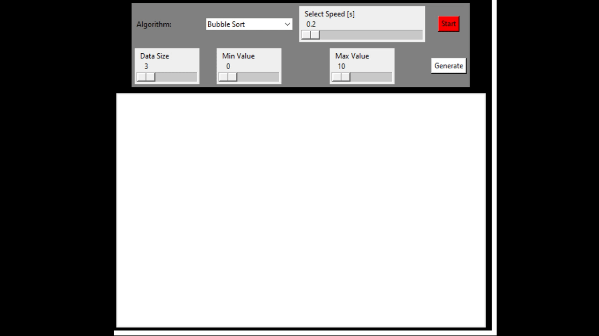
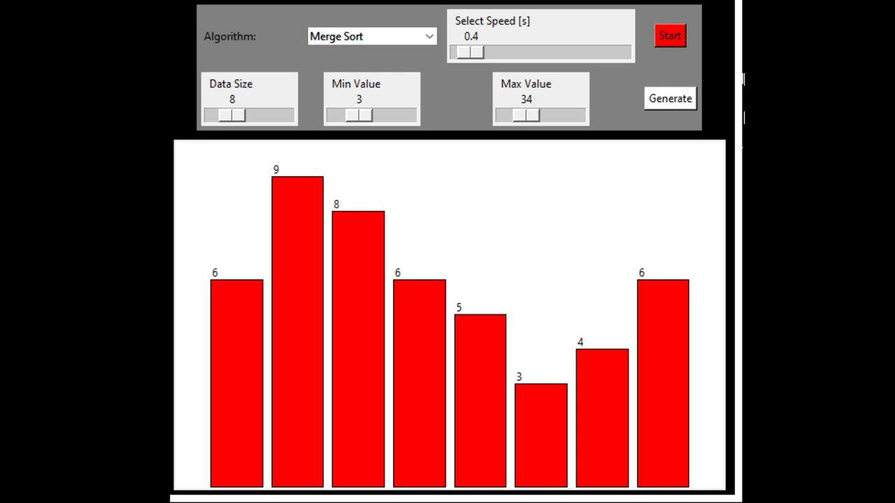

# Algorithm-Visualizer

*__This project is for educational purpose. The main objective of this project is to help beginners to be able to visualize the basic algorithms and get a better understanding of the underlying operations. And obviously Anyone who is willing to contribute is invited to use their creativity in making the visualizations even better and attractive. One can add fresh Algorithms and visualization of their choice too.__*

## Visualisation:

#### Bubble Sort


#### Merge Sort


## Steps to run:
```
Download or clone all the files
```

```
Install python
```

``` 
Install tkinter
```

``` 
Run main.py
```

``` 
Rest is user friendly :)
```
